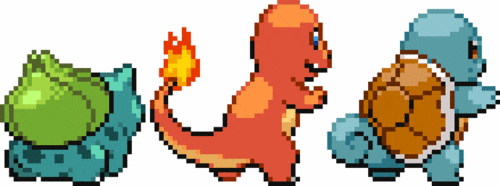
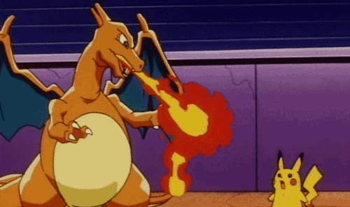
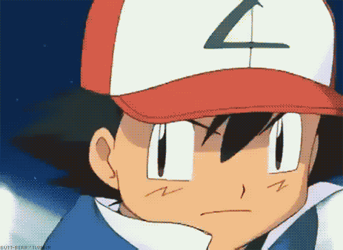

# Caza-pokimon #

## Introducción ##

Haremos una aplicación que contará con las 3 herramientas que aprenderemos la semana de la visualizacion de datos:
- Uso de API externa
- Mapas
- Gráficas

## Objetivos ##

Pintarás 20 pokimons sobre un mapa al iniciarse y con cada click de ratón agregará uno más. Dispondremos de gráficas en un lateral que nos darán datos sobre la población de pokimons representada.

## Requisitos ##

- Precurso web
- Programación avanzada
- Manejo de APIs
- [Leaflet]
- [Chartist]

## Iteraciones ##

### Lunes ###

Tendrías que haber conseguido realizar la [plantilla HTML5 con linters] y tener tu base a utilizar durante la semana. Si no has terminado, te animo a que uses la [plantilla HTML5 con linters de TheBridge] y así poder seguir el ritmo diario.

Tu objetivo será disponer todo el entorno para desarrollar la aplicación.

1. Crea tu proyecto, con los requisitos dispuestos en la [plantilla HTML5 con linters] que hiciste anteriormente

2. Haz una llamada a [Pokeapi] y trae 20 pokimons de la primera generación. Los Pokimons han de ser una colección donde cada uno tiene que tener el tipo de elemento al que pertenece y nombre, al menos.

### Martes ###

3. Hoy pondrás los 20 pokimons en marcadores.

  Los marcadores se dispondrán de manera aleatoria por toda la península ibérica, y cada vez que pulses un marcador, se mostrará en un "popup" o burbuja el nombre del pokimon al que corresponde.

_Premium_

4. Pon un círculo alrededor de cada marcador, con un color del elemento al que perteneced. Si tiene dos, han de ser círculos concéntricos, uno de mayor diámetro que otro.

### Miércoles ###

5. Cada marcador que alberga un pokemon tendrá una imagen personalizada. Para ello acudiremos a [PokemonDB], que posee un apartado de "sprites", y ahí podrás encontrar en cada imagen, y según el nombre del pokimon, lo necesario.

  Por ejemplo, en la página https://pokemondb.net/sprites/bulbasaur se puede encontrar la imagen de dicho pokimon en su primera generación https://img.pokemondb.net/sprites/red-blue/normal/bulbasaur.png

### Jueves ###

6. Representa la distribución de pokimons según la naturaleza del mismo. Tendrás que hacer 2 gráficas, una de barras y otra "de queso".

  Divide la pantalla en tres columnas y ponlo en una de ellas, reservando dos tercios de la pantalla para el mapa y el tercio restante para las dos gráficas, una encima de otra.

### Viernes ###

7. Haz uso de los eventos para poner un nuevo pokimon allí donde hagas click sobre el mapa. Este pokimon ha de estar completo, es decir, con su imagen incluída.

_premium_

Asegúrate de que se actualizan las gráficas con el nuevo pokimon.

[Chartist]: https://gionkunz.github.io/chartist-js "Chartist"
[Leaflet]: https://leafletjs.com "Leaflet"
[plantilla HTML5 con linters]: https://github.com/TheBridge-FullStackDeveloper/visualizacion-y-consumo-api-pp-template "HTML5 template with linters"
[plantilla HTML5 con linters de TheBridge]: https://github.com/TheBridge-FullStackDeveloper/template-html5-linter "template-html5-linter"
[Pokeapi]: https://pokeapi.co "Pokeapi"
[PokemonDB]: https://pokemondb.net/sprites "PokemonDB"
